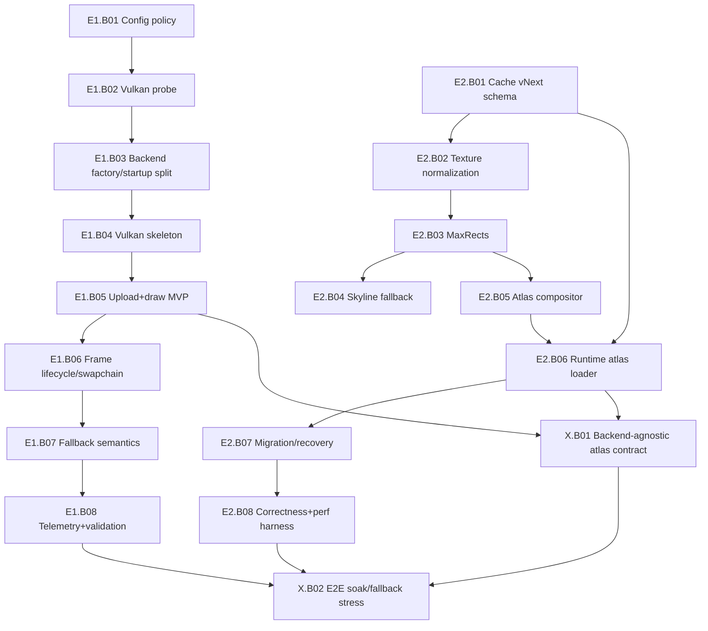

# Remediation Backlog

This document tracks the remediation plan for issues identified in `doc/PHD_CRITICAL_REVIEW.md`. Issues are prioritized from P0 (most critical) to P3 (lowest priority).

---

## P0: Critical Issues (Must-Fix for Stability & Correctness)

- [x] **Board 1.1: Frustum Bottom Plane Double-Written:** Remove dead code in `src/Frustum.cpp` where the bottom plane is calculated twice. (Already fixed)
- [x] **Board 1.2: Light Position Inconsistency:** Centralize the light position calculation to a single function to prevent shadow drift.
- [x] **Board 2.1 / 8.1: Memory/Resource Leak in `GpuProgram`:** Replace raw `new`/`delete` with `std::unique_ptr` in `OpenGLBackend` for `gpuProgram` and `shadowProgram` to ensure automatic cleanup and prevent leaks.
- [x] **Board 2.2: Unsafe Texture Data Ownership:** Change the `textureFromSurface` function signature in `Renderer.cpp` to take ownership of the `SDL_Surface` pointer, for instance by using a `std::unique_ptr`, to prevent potential use-after-free bugs.
- [x] **Board 2.3: Data Race in Binary Cache Writer:** Add `std::mutex` protection in the `CreateBinCache` thread function to prevent concurrent, unsynchronized access to shared `Renderer` data.
- [x] **Board 3.1: Data Race in Scene Loader:** Ensure the `buildScene` method acquires the `sceneDataMutex` to prevent data races with the main thread.
- [x] **Board 5.1: Broken Backend Abstraction:** Refactor `Renderer.cpp` to call `bufferToGpu()` and other methods through the `IRenderBackend` interface instead of using `static_cast`, restoring the architectural abstraction.
- [x] **Board 6.1: Path Traversal Vulnerability:** Implement proper path validation in `resolveModelPath` and texture loading logic to prevent access to files outside the intended directories.
- [x] **Board 8.2: FBO Leak in Shadow Map Creation:** Add `glDeleteFramebuffers` for the old FBO before generating a new one in `createShadowMap` to plug a significant GPU resource leak.

---

## P1: High-Priority Issues (Performance, Design & UX)

- [x] **Board 1.3: Inefficient Bounding Sphere Calculation:** Replace the current centroid-based bounding sphere calculation in `Renderer.cpp` with a more accurate and efficient algorithm like Welzl's or Dan Sunday's `minbound_sphere` approximation.
- [x] **Board 1.4: Incorrect Wavefront Material ID Handling:** Fix the logic in `Renderer.cpp` to correctly handle transitions between faces with assigned and unassigned materials, ensuring geometry is grouped correctly.
- [x] **Board 1.5: Shader Source Loading Loses Line Endings:** While minor, investigate if normalizing line endings in `Shader.cpp` causes issues with any specific drivers and consider a more robust file reading method.
- [x] **Board 2.4: `shutdown()` Order with Stale GL Context:** Re-order application shutdown logic to ensure `OpenGLBackend::shutdown()` is called *before* the OpenGL context is destroyed.
- [x] **Board 2.5: Excessive Error Output from `ConfigLoader`:** Reduce the verbosity of `ConfigLoader` to only report missing keys once or at a debug log level to improve the user experience on startup.
- [x] **Board 2.6: Non-Deterministic Binary Cache:** Change `renderer->materials` from `std::unordered_map` to `std::map` or sort keys before writing to ensure the binary cache is reproducible.
- [x] **Board 3.2: Orphaned Cache Writer Threads:** In `Renderer::bufferToGpu`, ensure any existing `binCacheWriterThread` is joined (`SDL_WaitThread`) before starting a new one.
- [x] **Board 3.3: Dangling `configLoader` Reference:** Investigate and fix the object lifetime issue where `OpenGLBackend` might access `configLoader` after its owner `Renderer` is destroyed.
- [x] **Board 3.4: Data Race on `sceneLoaded` Flag:** Replace the `bool sceneLoaded` with `std::atomic<bool>` to ensure safe cross-thread access.
- [x] **Board 4.1: Shaders Recompiled Every Frame:** Modify `OpenGLBackend` to use the existing `ShaderCache` and compile/link shader programs only once at startup, not every time `bufferToGpu()` is called.
- [x] **Board 4.2: Frustum Extracted Unnecessarily:** Only extract the frustum in the render loop if a culling feature is actually enabled.
- [x] **Board 4.3: Per-Frame Sorting of Visible Nodes:** Replace `std::sort` on visible nodes with a more performant approach like texture bucketing (radix sort or hashing).
- [x] **Board 4.4: Shadow Map Regenerated Unnecessarily:** Add a dirty flag system to only regenerate the shadow map when the scene geometry or light position changes.
- [x] **Board 4.5: Per-Frame Vector Allocations in Render Path:** Reuse member vectors (`m_visibleNodeIds`, etc.) for collecting and sorting nodes to avoid heap allocations in the hot path.
- [ ] **Board 5.2: "Scene Graph" Is a Flat Vector:** Evolve the `SceneNode` and `Renderer` to support a true hierarchical graph structure with parent-child transforms. (Major undertaking)
- [ ] **Board 5.3: `Renderer` God Class:** Break down the `Renderer` class into smaller, more focused components (e.g., `SceneManager`, `TextureManager`, `CullingSystem`). (Major undertaking)
- [ ] **Board 5.4: `MyGLApp` God Class:** Decompose `MyGLApp` into more focused classes for input, windowing, and application state. (Major undertaking)
- [x] **Board 5.5: `ShaderCache` Is Unused:** This is a duplicate of Board 4.1. The fix is to wire the cache into the backend.
- [x] **Board 6.2: `sprintf_s` Buffer Overflow Risk:** Replace `sprintf_s` with a safer, more robust string formatting method like `std::format` (C++20) or `snprintf`.
- [x] **Board 6.3: No Input Validation on OBJ File Content:** Add checks after parsing an OBJ file to ensure the application doesn't process invalid or empty data, preventing crashes.
- [x] **Board 7.1: Sprinkled SDL2/SDL3 Conditionals:** Decide on a single primary SDL version (likely SDL3) and remove the legacy SDL2 compatibility code to simplify maintenance.
- [x] **Board 7.2: Windows-Only `sprintf_s`:** Replace MSVC-specific functions with portable alternatives like `snprintf`.
- [x] **Board 7.3: Platform-Dependent Directory Separator:** Use `std::filesystem` or forward slashes exclusively for path manipulation.
- [x] **Board 8.3: VAO State Not Restored:** Ensure the VAO state is properly saved and restored if other parts of the application need to bind their own VAOs.
- [x] **Board 8.4: Incomplete Persistent VBO Mapping Fallback:** Add `glFlushMappedBufferRange` or other appropriate synchronization to the fallback path for persistent VBO mapping.
- [x] **Board 8.5: Hardcoded Pink Clear Color:** Move the `glClearColor` value to a configuration file.

---

## Epics

- [ ] **Epic E1: Vulkan Renderer with Automatic Backend Selection**

	**Why this epic matters**
	- Current startup path is hard-wired to OpenGL (`main.cpp` creates an OpenGL context and always constructs `OpenGLBackend`).
	- The backend abstraction (`IRenderBackend`) already exists, so runtime backend selection is now an architectural gap, not a greenfield rewrite.
	- Vulkan can reduce CPU overhead and improve modern GPU utilization while preserving GL 3.3 fallback compatibility.

	**Design decisions (researched + pragmatic)**
	- Add a backend selector policy with config value `renderer.backend = auto|opengl|vulkan`.
	- In `auto` mode, probe Vulkan support first using SDL3 Vulkan integration points (`SDL_Vulkan_LoadLibrary`, `SDL_Vulkan_GetInstanceExtensions`, `SDL_Vulkan_CreateSurface`) and verify at least one present-capable physical device/queue.
	- If probe or initialization fails at any stage, log structured reason and hard-fallback to OpenGL in the same launch.
	- Keep `IRenderBackend` as the main seam; implement `VulkanBackend` behind it and avoid leaking API-specific handles into `Renderer`.
	- Use a two-phase startup path for window/context creation so backend choice controls window flags (`SDL_WINDOW_VULKAN` vs `SDL_WINDOW_OPENGL`).

	**Milestones**
	- [ ] **E1.1 Build and dependency plumbing**: Add optional Vulkan build support in `CMakeLists.txt` (`find_package(Vulkan)` + guarded `VulkanBackend` target sources).
	- [ ] **E1.2 Backend selector and startup orchestration**: Introduce `RenderBackendFactory`/selector that decides backend before final window/context setup.
	- [ ] **E1.3 Vulkan backend MVP parity**: Implement `initialize/shutdown/beginFrame/submit/endFrame/bufferToGpu` for static mesh draw path, texture sampling, and depth test parity with existing GL behavior.
	- [ ] **E1.4 Feature parity and safety**: Add shadows path parity or explicit temporary capability downgrade matrix; ensure screenshot and resize behavior are deterministic.
	- [ ] **E1.5 Telemetry + diagnostics**: Emit chosen backend, probe results, and fallback reason codes in startup logs and on-screen profile HUD.
	- [ ] **E1.6 Validation matrix**: Test `auto`, forced OpenGL, forced Vulkan, and forced Vulkan with synthetic failure (library missing/device unsupported) to verify graceful fallback.

	**Acceptance criteria**
	- [ ] On Vulkan-capable hardware, `auto` selects Vulkan and renders the same scene content (geometry/material assignment) as OpenGL baseline.
	- [ ] On non-capable hardware, `auto` selects OpenGL without crash or manual user intervention.
	- [ ] Forced `renderer.backend=vulkan` fails with clear error text and non-zero exit only when fallback is explicitly disabled.
	- [ ] No regressions in existing cache load path, controls, or shadow toggles when running OpenGL fallback.

	**Risks and mitigations**
	- Risk: startup coupling to OpenGL-specific window/context code in `main.cpp`.
		Mitigation: isolate startup into backend-agnostic bootstrap + backend-specific context/surface setup.
	- Risk: shader pipeline divergence (GLSL vs SPIR-V asset flow).
		Mitigation: establish a shader asset pipeline contract early (offline compile to SPIR-V; keep GL shader path unchanged).
	- Risk: synchronization bugs in first Vulkan pass.
		Mitigation: begin with a single-frame-in-flight mode and validation layers on debug builds before scaling.

- [ ] **Epic E2: Textured Model Cache with Advanced Rectangle Packing**

	**Why this epic matters**
	- Current cache serializes textures as independent raw blobs; load path reconstructs many individual textures and binds.
	- Packing textures into atlases can improve locality, reduce binds, reduce metadata overhead, and speed startup/render hot path.

	**Design decisions (researched + pragmatic)**
	- Extend cache format to a chunked versioned schema (header + typed blocks) instead of implicit sequential dumps.
	- Introduce atlas groups by compatible texture class (diffuse/normal/specular), format, and sampler constraints.
	- Use an advanced rectangular packer with deterministic ordering and quality/speed controls:
		- Primary heuristic: MaxRects (Best Short Side Fit) with optional rotate policy.
		- Secondary fallback: Skyline for very large pack sets where runtime bounds are exceeded.
		- Deterministic insertion order (area/perimeter tie-breakers) so cache output is reproducible.
	- Store per-subtexture UV transform (`scaleU, scaleV, biasU, biasV`) and border padding metadata to prevent bleed.
	- Add atlas generation safeguards: configurable padding, optional edge dilation, and power-of-two sizing option.

	**Milestones**
	- [ ] **E2.1 Cache schema vNext**: Define `BinCacheFileHeaderV2` + chunk table (`materials`, `sceneNodes`, `vertices`, `atlasMeta`, `atlasPixels`) with forward-compatible unknown-chunk skipping.
	- [ ] **E2.2 Packer module**: Add a dedicated packer component with deterministic input normalization and benchmark hooks (packing ratio, runtime, atlas count).
	- [ ] **E2.3 Atlas builder pipeline**: Decode source textures, normalize formats, build atlas pages, and emit UV remap records per material texture slot.
	- [ ] **E2.4 Runtime loader integration**: Load atlas textures first, then bind subtexture metadata to scene/material data so draw path uses atlases transparently.
	- [ ] **E2.5 Backward compatibility + migration**: Continue reading legacy cache version and regenerate into vNext when legacy cache is detected.
	- [ ] **E2.6 Validation + performance gates**: Add tests for UV correctness, seam/bleed cases, deterministic cache bytes, and startup/render KPI improvements.

	**Acceptance criteria**
	- [ ] Atlas-enabled cache reproduces visually equivalent output on `models/scene.obj` and `models/cube.obj` (no UV drift, no texture seam artifacts under camera motion).
	- [ ] Cache rebuild is deterministic for unchanged inputs (same binary hash on same platform/config).
	- [ ] Startup path with warm cache performs fewer texture binds and fewer texture objects than baseline.
	- [ ] Corrupt atlas chunk or unsupported schema gracefully invalidates cache and rebuilds from OBJ without crash.

	**Risks and mitigations**
	- Risk: UV precision and mip bleed artifacts at tile borders.
		Mitigation: per-tile padding + edge dilation + clamp-aware UV remap tests.
	- Risk: oversized atlases on low-end hardware.
		Mitigation: query max texture size at runtime and split into multiple atlas pages automatically.
	- Risk: normal/specular channel mismatches when formats differ.
		Mitigation: separate atlas classes by semantic/format; do not force cross-semantic packing.

---

## Epic Execution Strategy

- [ ] **Phase order**: Deliver E1.1-E1.3 first (backend selection + Vulkan MVP) before E2.3-E2.4 so cache/atlas runtime integration can be validated against both backends.
- [ ] **Shared observability**: Standardize startup/render metrics logging once, then reuse in both epics (`backendChosen`, `fallbackReason`, `cacheVersion`, `atlasCount`, `textureBindCount`).
- [ ] **Rollback policy**: Keep feature flags for both epics (`renderer.backend`, `renderer.cache.atlas.enabled`) so regressions can be disabled without reverting code.

## KPI Targets (Definition of "Very Good")

- [ ] **Backend reliability**: `auto` backend selection succeeds without manual changes on at least 95% of test launches across supported dev machines.
- [ ] **Fallback correctness**: Vulkan probe/init failures fall back to OpenGL in under 250 ms additional startup overhead.
- [ ] **Atlas packing quality**: Achieve at least 88% median atlas occupancy on project texture sets with no visible seam artifacts.
- [ ] **Runtime efficiency**: Reduce per-frame texture binds by at least 35% on atlas-enabled scenes versus current baseline.
- [ ] **Cache determinism**: Repeated cache generation with identical inputs produces byte-identical cache files.

---

## Sprint-Sized Boards (E1/E2)

Effort legend: XS (0.5-1 day), S (1-2 days), M (2-4 days), L (4-7 days)

### E1 Boards: Vulkan + Auto-Selection

- [ ] **Board E1.B01: Backend policy config and parser**
	- Scope: Add `renderer.backend=auto|opengl|vulkan` parsing and validation in config flow.
	- Estimate: XS (~6h)
	- Depends on: none
- [ ] **Board E1.B02: Runtime capability probe module**
	- Scope: Add Vulkan capability probe using SDL Vulkan entry points and device/present checks.
	- Estimate: M (~14h)
	- Depends on: E1.B01
- [ ] **Board E1.B03: Backend factory and startup split**
	- Scope: Refactor startup into backend-agnostic bootstrap + backend-specific window/context creation.
	- Estimate: M (~16h)
	- Depends on: E1.B01, E1.B02
- [ ] **Board E1.B04: Vulkan backend skeleton**
	- Scope: Create `VulkanBackend` class implementing `IRenderBackend` with safe no-op/stub internals for unsupported features.
	- Estimate: S (~10h)
	- Depends on: E1.B03
- [ ] **Board E1.B05: Vulkan geometry and texture upload MVP**
	- Scope: Implement static mesh upload, descriptor setup, and indexed draw submission path.
	- Estimate: L (~28h)
	- Depends on: E1.B04
- [ ] **Board E1.B06: Vulkan frame lifecycle and swapchain resilience**
	- Scope: Handle acquire/present, resize recreation, and frame sync correctness.
	- Estimate: L (~26h)
	- Depends on: E1.B05
- [ ] **Board E1.B07: Fallback semantics and error taxonomy**
	- Scope: Add fallback reason codes and hard/soft failure behavior for `auto` and forced backend modes.
	- Estimate: S (~8h)
	- Depends on: E1.B03, E1.B06
- [ ] **Board E1.B08: Telemetry, HUD stats, and validation scenarios**
	- Scope: Report backend choice, probe timings, fallback reasons; run scenario matrix.
	- Estimate: S (~8h)
	- Depends on: E1.B07

### E2 Boards: Atlas Cache + Rectangle Packing

- [ ] **Board E2.B01: Cache vNext schema and chunk registry**
	- Scope: Define binary schema with chunk table and version upgrade path.
	- Estimate: M (~12h)
	- Depends on: none
- [ ] **Board E2.B02: Deterministic texture inventory and normalization**
	- Scope: Build deterministic texture list and normalization rules (semantic + format + sampler class).
	- Estimate: S (~8h)
	- Depends on: E2.B01
- [ ] **Board E2.B03: MaxRects packer implementation**
	- Scope: Implement deterministic MaxRects (BSSF) with optional rotation and padding controls.
	- Estimate: L (~24h)
	- Depends on: E2.B02
- [ ] **Board E2.B04: Skyline fallback path and guardrails**
	- Scope: Add Skyline fallback for stress cases and define switch thresholds.
	- Estimate: M (~12h)
	- Depends on: E2.B03
- [ ] **Board E2.B05: Atlas pixel compositor and edge dilation**
	- Scope: Compose atlas pages, add gutters/padding, write UV remap metadata.
	- Estimate: L (~22h)
	- Depends on: E2.B03
- [ ] **Board E2.B06: Runtime atlas loader integration**
	- Scope: Load atlas chunks into runtime texture objects and remap material texture coordinates.
	- Estimate: M (~16h)
	- Depends on: E2.B01, E2.B05
- [ ] **Board E2.B07: Legacy cache migration + corruption recovery**
	- Scope: Read legacy cache safely, migrate to vNext, and rebuild on invalid atlas chunks.
	- Estimate: S (~10h)
	- Depends on: E2.B01, E2.B06
- [ ] **Board E2.B08: Visual correctness and performance test harness**
	- Scope: Add UV seam tests, determinism checks, occupancy stats, startup/bind KPI tracking.
	- Estimate: M (~14h)
	- Depends on: E2.B06, E2.B07

### Cross-Epic Integration Boards

- [ ] **Board X.B01: Backend-agnostic atlas binding contract**
	- Scope: Define one material/atlas binding contract consumed by OpenGL and Vulkan paths.
	- Estimate: S (~8h)
	- Depends on: E1.B05, E2.B06
- [ ] **Board X.B02: End-to-end soak + fallback stress tests**
	- Scope: Run long-form startup/reload/fallback loops with atlas-enabled caches on both backends.
	- Estimate: M (~14h)
	- Depends on: E1.B08, E2.B08, X.B01

---

- [ ] **Epic E3: Interactive Multi-Backend Renderer (Vulkan/OpenGL) with ImGui**

	**Why this epic matters**
	- Provides users with direct control over the rendering backend, allowing them to choose between performance (Vulkan) and compatibility (OpenGL).
	- Introduces a flexible and extensible UI framework (ImGui) that can be used for future features like scene inspection, performance metrics, and graphics settings.
	- Modernizes the rendering architecture to be modular and support multiple graphics APIs, a common feature in robust rendering engines.

	**Design decisions (researched + pragmatic)**
	- The `IRenderBackend` interface will be the primary seam between the `Renderer` and the graphics API-specific code.
	- A new `UIManager` class will be created to encapsulate all ImGui setup, rendering, and UI panel logic.
	- Backend selection will be persisted in `config/app.cfg`. The default on first launch will be OpenGL, as it is the most stable and widely supported.
	- Switching the renderer via the UI will require an application restart. The UI will clearly communicate this to the user and handle the config change.
	- The Vulkan backend will be implemented using the official `Vulkan-Hpp` C++ bindings for improved safety and ergonomics.
	- The OpenGL backend will target a modern Core Profile (e.g., 4.5) to align with desktop capabilities, rather than OpenGL ES, but the abstraction will allow for an ES backend in the future.

	**Milestones**
	- [ ] **E3.1 Dependency Integration**: Add ImGui and Vulkan-Hpp as dependencies into the CMake build system. Ensure the Vulkan SDK is correctly located.
	- [ ] **E3.2 Renderer Abstraction**: Refactor the existing `OpenGLBackend` to implement a new `IRenderBackend` interface, ensuring no loss of current functionality.
	- [ ] **E3.3 UI Scaffolding**: Create a `UIManager` and integrate ImGui's lifecycle (initialization, new frame, rendering, shutdown) into the main application loop. Render a basic, empty settings window.
	- [ ] **E3.4 Backend Switching Logic**: Implement the factory logic in `main.cpp` to instantiate the correct backend based on the value in `config/app.cfg`.
	- [ ] **E3.5 UI-Config Interaction**: Build the UI panel with a dropdown to select "OpenGL" or "Vulkan". On change, this will update `app.cfg` and prompt the user to restart.
	- [ ] **E3.6 Vulkan Backend MVP**: Implement a minimal `VulkanBackend` that can clear the screen to a solid color. This verifies the entire Vulkan initialization and swapchain pipeline.
	- [ ] **E3.7 Vulkan Backend Feature Parity**: Extend the `VulkanBackend` to match the `OpenGLBackend`'s functionality (rendering static models, textures, shadows).

	**Acceptance criteria**
	- [ ] The application starts and runs correctly using the existing OpenGL backend.
	- [ ] A new "Settings" window can be opened, showing a dropdown for renderer selection.
	- [ ] Selecting a new renderer in the UI and restarting the application causes the application to launch with the chosen backend.
	- [ ] The Vulkan backend, when selected, renders the same scene content as the OpenGL backend.
	- [ ] Both backends can be selected and run without crashes or visual artifacts.

	**Risks and mitigations**
	- Risk: The effort to achieve feature parity in the Vulkan backend is significant.
		Mitigation: Implement the Vulkan backend incrementally, starting with a simple clear screen (MVP) and building up features one by one, with clear "not yet implemented" markers for missing functionality.
	- Risk: Complexity of managing two separate ImGui rendering backends.
		Mitigation: Adapt the official ImGui OpenGL and Vulkan example backends, keeping the integration code isolated within the respective `OpenGLBackend` and `VulkanBackend` classes.
	- Risk: System configuration issues finding the Vulkan SDK.
		Mitigation: Provide clear instructions in `README.md` on how to install the Vulkan SDK and ensure CMake can find it. Add checks in CMake to provide helpful error messages.

## Dependency Graph (Critical Path)

## Suggested Sprint Packaging

- [ ] **Sprint 1 (Foundations)**: E1.B01, E1.B02, E1.B03, E2.B01
- [ ] **Sprint 2 (MVP pipelines)**: E1.B04, E1.B05, E2.B02, E2.B03
- [ ] **Sprint 3 (Hardening)**: E1.B06, E1.B07, E2.B04, E2.B05
- [ ] **Sprint 4 (Integration and quality)**: E1.B08, E2.B06, E2.B07, X.B01
- [ ] **Sprint 5 (Validation and soak)**: E2.B08, X.B02

---

## Epic E4: Multi-API Rendering with ImGui and Persistence

	**Why this epic matters**
	- Expands rendering compatibility to modern mobile platforms (OpenGL ES 3.2) and the very latest desktop/workstation APIs (Vulkan 1.4).
	- Provides a user-friendly way (ImGui) to select the desired rendering profile at startup, catering to different hardware capabilities and developer preferences.
	- Persists the user's choice, improving the user experience by remembering the preferred rendering setup.

	**Design decisions (researched + pragmatic)**
	- The existing `IRenderBackend` interface will be extended to accommodate specific features of OpenGL ES 3.2 and Vulkan 1.4, ensuring a unified interface for the `Renderer`.
	- ImGui will be integrated to present a startup dialog allowing the user to select between "OpenGL ES 3.2", "Vulkan 1.4", and "OpenGL 4.5" (desktop GL).
	- The selected rendering profile will be saved to `config/app.cfg` (e.g., `renderer.profile = gles32|vulkan14|gl45`).
	- The application will load the saved preference on subsequent launches. If no preference is found, it will default to OpenGL ES 3.2 (for broad mobile compatibility) or automatically detect the best available.
	- Switching profiles via the UI will require an application restart. The UI will clearly communicate this.
	- For the model loading UI, a simple file chooser dialog will be implemented, potentially using a lightweight, single-header library like `ImGuiFileDialog`.

	**Milestones**
	- [ ] **E4.1 ImGui Integration**: Add ImGui as a dependency and integrate its basic setup and rendering into the application's main loop, suitable for a startup dialog.
	- [ ] **E4.2 Config Persistence**: Implement logic in `ConfigLoader` to read and write the `renderer.profile` setting to `config/app.cfg`.
	- [ ] **E4.3 Profile Selection UI**: Create an ImGui window that appears at startup, allowing the user to choose their preferred rendering profile (OpenGL ES 3.2, Vulkan 1.4, OpenGL 4.5).
	- [ ] **E4.4 OpenGL ES 3.2 Backend MVP**: Develop a minimal `OpenGLESBackend` that clears the screen, integrating with `IRenderBackend`.
	- [ ] **E4.5 Vulkan 1.4 Backend MVP**: Extend the existing `VulkanBackend` (or create a new one if necessary) to specifically target Vulkan 1.4 features and integrate with `IRenderBackend`.
	- [ ] **E4.6 Startup Orchestration**: Modify `main.cpp` to initialize the correct backend based on the loaded or selected `renderer.profile`, handling fallback gracefully if a chosen API is unavailable.
	- [ ] **E4.7 Full Feature Parity**: Bring all new backends (OpenGL ES 3.2, Vulkan 1.4) to feature parity with the existing OpenGL 4.5 capabilities (model loading, textures, shadows, etc.).
	- [ ] **E4.8 Model File Chooser**: Implement an ImGui file chooser dialog to allow runtime loading of different `.obj` models from the filesystem.

	**Acceptance criteria**
	- [ ] At first launch, the application presents an ImGui dialog for renderer selection.
	- [ ] The chosen profile is saved and loaded correctly on subsequent application launches.
	- [ ] The application can successfully initialize and render a basic scene using OpenGL ES 3.2, Vulkan 1.4, and OpenGL 4.5.
	- [ ] Switching between rendering profiles via the UI and restarting the application works as expected, leading to the chosen backend being active.
	- [ ] A user can open a file dialog from the UI, select a new `.obj` model, and see it loaded and rendered in the scene.
	- [ ] No visual regressions or crashes occur when running with any of the supported rendering profiles.

	**Risks and mitigations**
	- Risk: Significant divergence in shader language (GLSL ES for GLES, SPIR-V for Vulkan, GLSL for desktop GL).
		Mitigation: Implement a robust shader asset pipeline that can compile/transpile shaders to the appropriate format for each backend.
	- Risk: Managing context creation and API-specific states for three different graphics APIs can be complex.
		Mitigation: Encapsulate API-specific logic entirely within their respective `IRenderBackend` implementations, minimizing cross-API dependencies and centralizing state management.
	- Risk: Ensuring cross-platform build system compatibility for all dependencies (ImGui, Vulkan SDK, SDL3) across different OS and compilers.
		Mitigation: Rigorous CMake scripting and testing on target platforms early in the development cycle.

---

## Epic E5: MCP-Powered End-to-End Rendering Debug Framework

	**Why this epic matters**
	- Enables efficient debugging of complex rendering pipelines, especially critical for AI-optimized development where rendering decisions might be opaque.
	- Provides an end-to-end view of the rendering process, from asset loading to final pixel output, facilitating quick identification and resolution of rendering anomalies.
	- Integrates with the MCP (Model Capture and Playback) system to capture and replay rendering states, allowing for deterministic debugging and analysis by AI systems.
	- Accelerates AI-driven rendering research and development by providing rich, actionable debugging data and automated anomaly detection capabilities.

	**Design decisions (researched + pragmatic)**
	- The framework will capture key rendering states and data at various stages of the pipeline (e.g., input geometry, shader parameters, texture bindings, render target contents).
	- Integration with MCP will allow for the serialization and deserialization of these captured states for replay and analysis.
	- A custom ImGui-based overlay will visualize captured data, allowing developers to inspect rendering parameters, view intermediate render targets, and identify rendering issues interactively.
	- AI optimization tools will leverage the captured data to analyze rendering performance, detect visual artifacts, and suggest optimizations.
	- The framework will support all render backends (OpenGL, OpenGL ES, Vulkan) by abstracting rendering commands and states into a common format.

	**Milestones**
	- [ ] **E5.1 Core Capture System**: Implement mechanisms to capture essential rendering data (vertex buffers, index buffers, shader programs, uniform buffers, textures, framebuffers) in a backend-agnostic manner.
	- [ ] **E5.2 MCP Integration**: Develop serialization/deserialization routines to store and retrieve captured rendering states using the MCP system.
	- [ ] **E5.3 Basic Replay Functionality**: Implement a system to replay captured rendering frames, ensuring visual fidelity with the original rendering.
	- [ ] **E5.4 ImGui Visualization Overlay**: Create an ImGui interface to browse captured frames, inspect rendering parameters (e.g., active shader, bound textures, uniform values), and toggle rendering stages.
	- [ ] **E5.5 Intermediate Render Target Viewer**: Add functionality to view the contents of intermediate render targets (e.g., depth maps, G-buffers, shadow maps) within the ImGui overlay.
	- [ ] **E5.6 AI Data Export**: Implement a feature to export captured rendering data in a structured format suitable for consumption by AI analysis tools (e.g., JSON, Protocol Buffers).
	- [ ] **E5.7 Automated Anomaly Detection (MVP)**: Develop a basic AI-powered system that can flag common rendering issues (e.g., NaN colors, black pixels, depth fighting) based on exported data.

	**Acceptance criteria**
	- [ ] The debug framework can capture and replay rendering frames correctly across all supported backends.
	- [ ] Developers can use the ImGui overlay to inspect any captured rendering state and intermediate render target.
	- [ ] Captured rendering data can be successfully exported and consumed by external AI analysis tools.
	- [ ] The automated anomaly detection system can identify and report at least two distinct rendering issues.
	- [ ] The framework introduces minimal performance overhead when not actively capturing or debugging.

	**Risks and mitigations**
	- Risk: Performance overhead of capturing extensive rendering state.
		Mitigation: Implement selective capture based on debug flags and granular control over what data is recorded. Optimize capture mechanisms for minimal CPU/GPU impact.
	- Risk: Complexity of abstracting and capturing state for multiple graphics APIs.
		Mitigation: Focus on common rendering concepts first, incrementally adding API-specific details. Leverage existing rendering abstraction (`IRenderBackend`) where possible.
	- Risk: Data volume for end-to-end rendering captures could be very large.
		Mitigation: Implement data compression, intelligent filtering, and partial frame capture strategies to manage data size.
	- Risk: AI models for anomaly detection may require significant training data and be prone to false positives/negatives.
		Mitigation: Start with simple, rule-based anomaly detection and gradually transition to more sophisticated ML models as data becomes available and confidence grows. Involve rendering experts in labeling ground truth.
