# SDL3-Wavefront Architecture Documentation

## Table of Contents
1. [System Overview](#1-system-overview)
2. [Component Architecture](#2-component-architecture)
3. [Class Hierarchy Diagrams](#3-class-hierarchy-diagrams)
4. [Data Flow Diagrams](#4-data-flow-diagrams)
5. [Render Pipeline](#5-render-pipeline)
6. [Memory Management](#6-memory-management)

---

## 1. System Overview

### High-Level Architecture

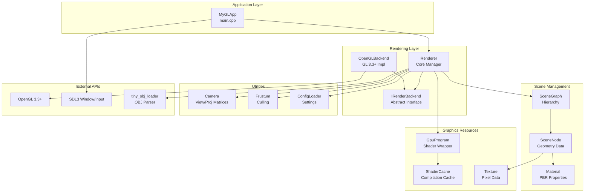

---

## 2. Component Architecture

### Component Dependencies

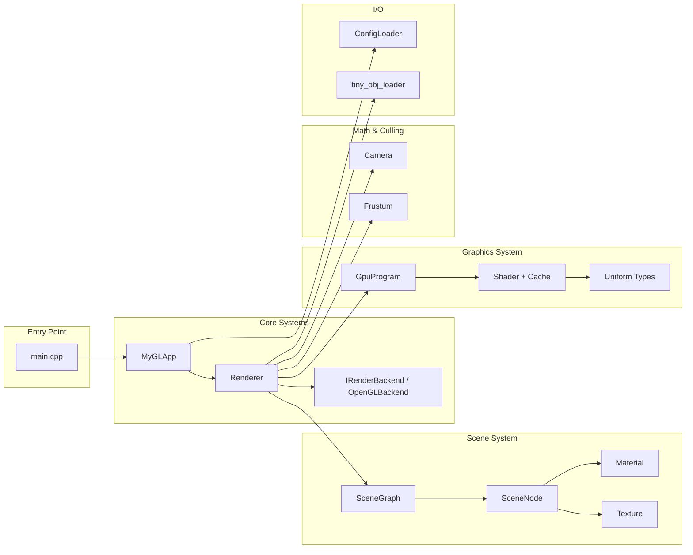

---

## 3. Class Hierarchy Diagrams

### Render Backend Hierarchy

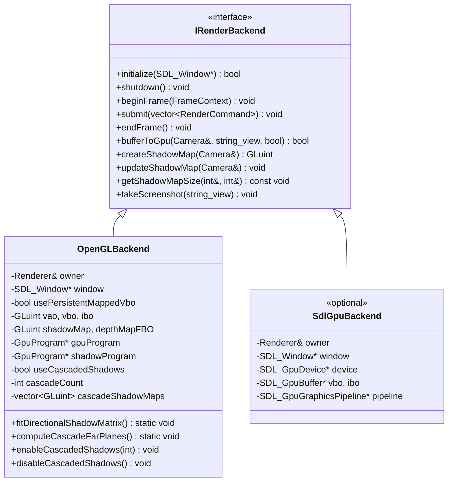

### Shader System Hierarchy

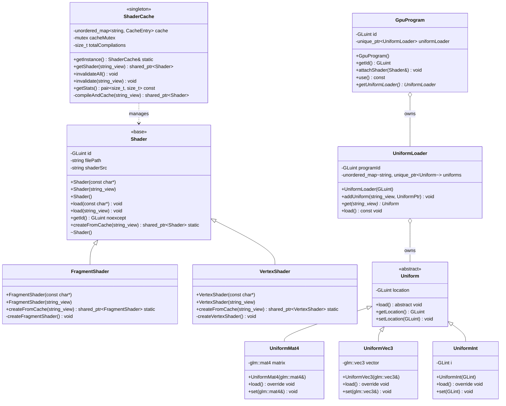

### Scene System Hierarchy

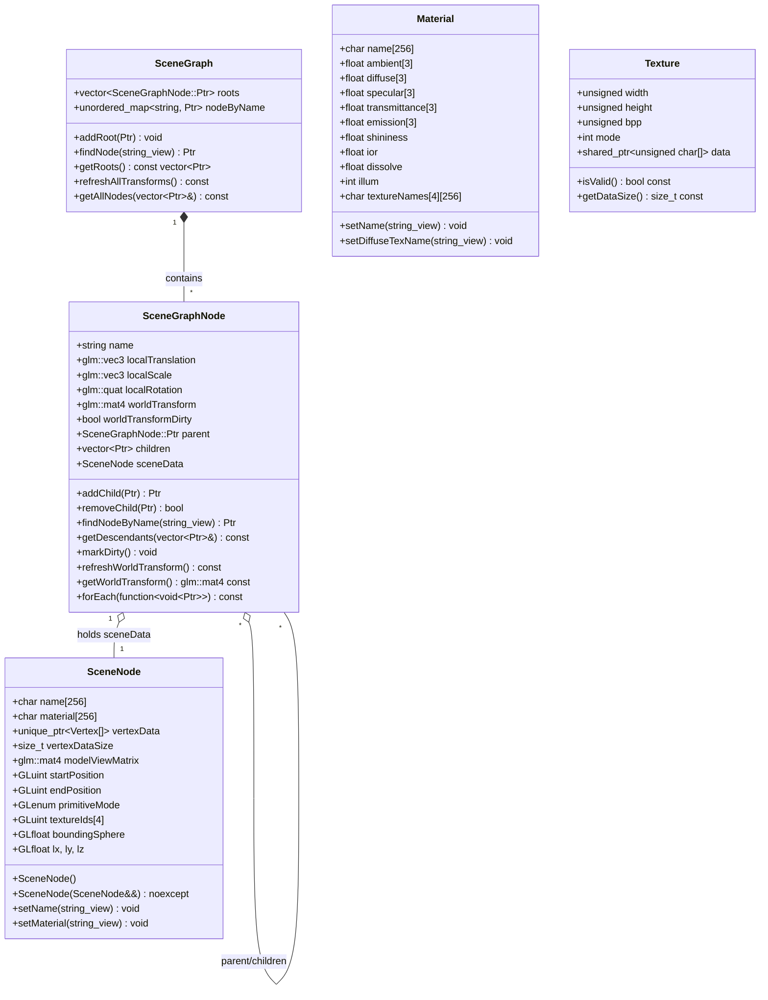

---

## 4. Data Flow Diagrams

### Application Startup Flow

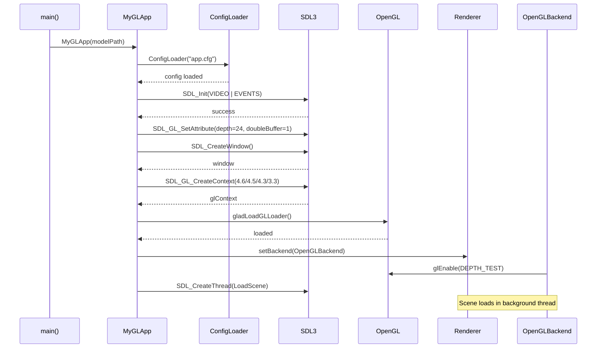

### Scene Loading Flow (Threaded)

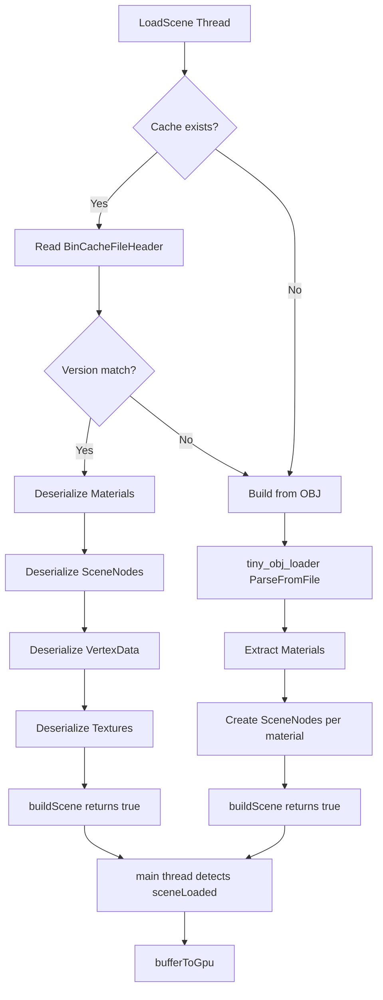

### Render Frame Flow

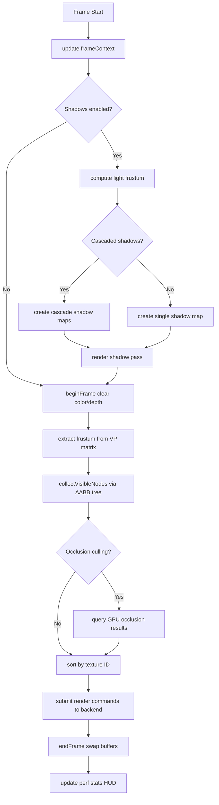

---

## 5. Render Pipeline

### GPU Resource Lifecycle

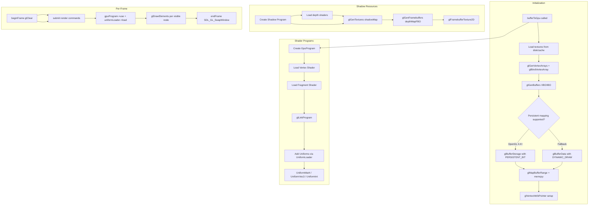

### Memory Allocation Map

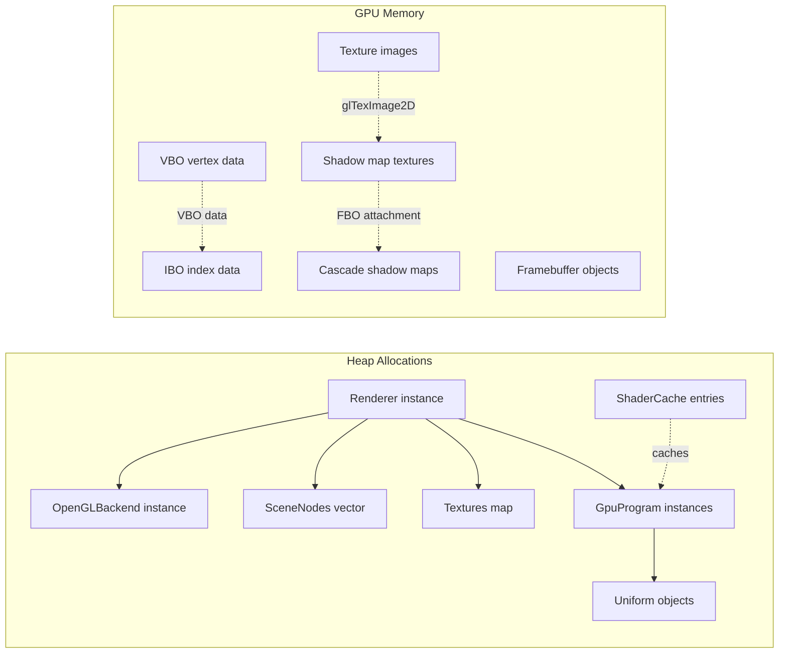

---

## 6. Memory Management

### Ownership Model

```mermaid
graph TB
    subgraph "Owner: Renderer"
        R[Renderer]
        R -->|owns|unique_ptr~ConfigLoader~ configLoader
        R -->|owns|unique_ptr~IRenderBackend~ backend
        R -->|owns|vector~SceneNode~ sceneNodes
        R -->|owns|vector~Vertex~ vertexData
        R -->|owns|vector~GLuint~ indices
        R -->|owns|unordered_map~string, Material~ materials
        R -->|owns|unordered_map~string, shared_ptr~Texture~~ textures
    end
    
    subgraph "Owner: OpenGLBackend"
        O[OpenGLBackend]
        O -->|owns|GpuProgram gpuProgram
        O -->|owns|GpuProgram shadowProgram
        O -->|owns|GLuint vao/vbo/ibo
        O -->|owns|GLuint shadowMap
        O -->|owns|GLuint depthMapFBO
        O -->|owns|vector~GLuint~ cascadeShadowMaps
    end
    
    subgraph "Owner: ShaderCache"
        SC[ShaderCache]
        SC -->|owns|unordered_map~string, CacheEntry~ cache
    end
    
    subgraph "Owner: Texture"
        T[Texture]
        T -->|owns|shared_ptr~unsigned char[]~ data
    end
    
    R --> O
    R --> SC
    T -.->|stored in| textures
```

### Thread Safety Model

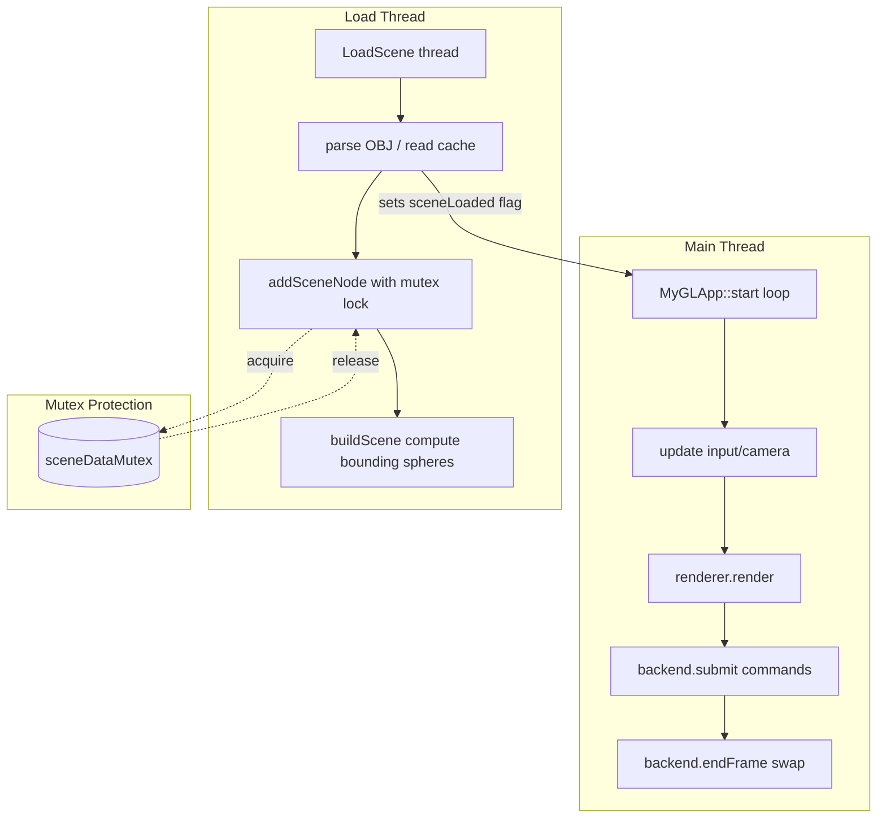

---

## Appendix: Key Design Patterns

| Pattern | Location | Purpose |
|---------|----------|---------|
| **Strategy** | `IRenderBackend` + implementations | Swap rendering backends without changing Renderer |
| **Factory** | `ShaderCache::getInstance()` | Lazy shader compilation with caching |
| **Composite** | `SceneGraph` → `SceneGraphNode` → children | Hierarchical scene representation |
| **Observer** | Dirty flag pattern on `SceneGraphNode` | Deferred world transform computation |
| **Singleton** | `ShaderCache` | Global shader compilation cache |
| **RAII** | `unique_ptr`, `shared_ptr` throughout | Automatic resource cleanup |
| **Bridge** | `Renderer` ↔ `IRenderBackend` | Decouple rendering logic from API |

---

*Generated for sdlgl3-wavefront project*
*Date: 2026-08-10*
